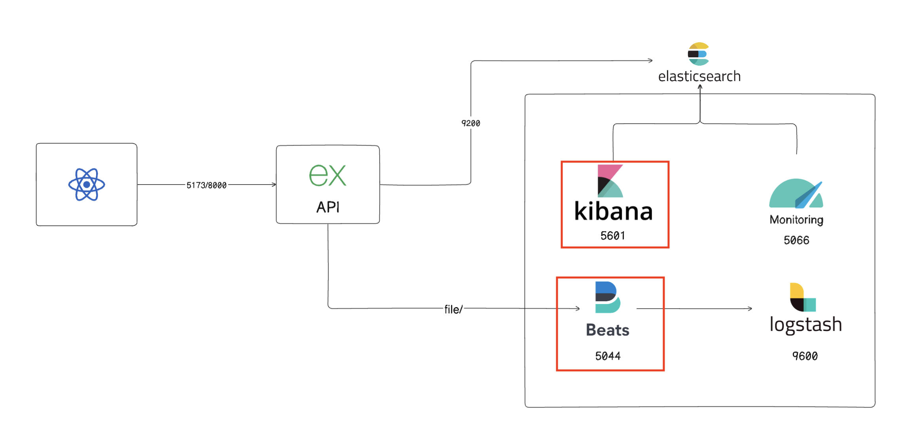
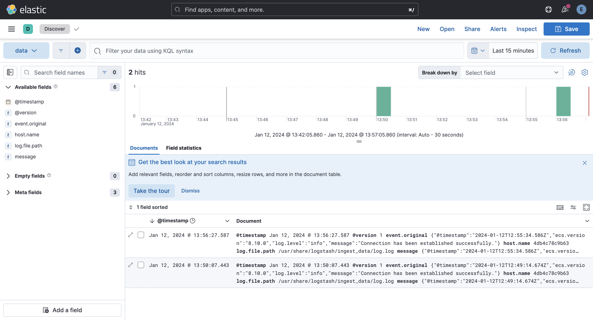

# README du Projet H3Micro

## IMPORTANT
---

## Projet : H3Micro - Adoptez les Microservices

### Introduction

Bienvenue dans le projet H3Micro ! Cette initiative sert de démonstration en direct de l'architecture des microservices, mettant en avant un écosystème bien coordonné de composants clés :

-   **Frontend** : Conçu avec React.
-   **Backend** : Élaboré avec Express.js.
-   **Réseau de Conteneurs** : Permettant une communication transparente entre tous les conteneurs.
-   **Volumes** : Assurant une persistance robuste des données à travers les conteneurs.
-   **Reverse Proxy** : Propulsé par Nginx pour sécuriser vos connexions, avec des certificats HTTPS pour le frontend et le backend.
-   **Scripts** : Doté d'une gamme de scripts utiles pour les vérifications de santé Docker, les tests de base de données et les tests complets du frontend et du backend.

### Prérequis

Avant de plonger dans ce projet, assurez-vous d'avoir installé les prérequis suivants :

-   [Docker](https://www.docker.com/get-started)
-   [Docker Compose](https://docs.docker.com/compose/install)

### Liens d'Accès

Explorez les différents composants de ce projet via les liens suivants :

-   **Frontend** :

    -   HTTP : [http://localhost:5173](http://localhost:5173)

-   **Backend** :

    -   HTTP : [http://localhost:8000](http://localhost:8000)

-   **Documentation Backend** :

    -   HTTP : [http://localhost:8000/api-docs](http://localhost:8000/api-docs)

### Captures d'écran

### Schéma d'Architecture de l'Environnement de Développement

Voici un aperçu architectural de l'environnement de développement :

## Tableau de bord des données en temps réel

