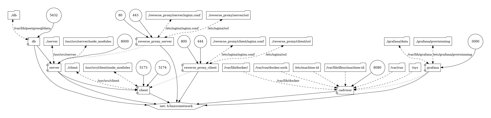
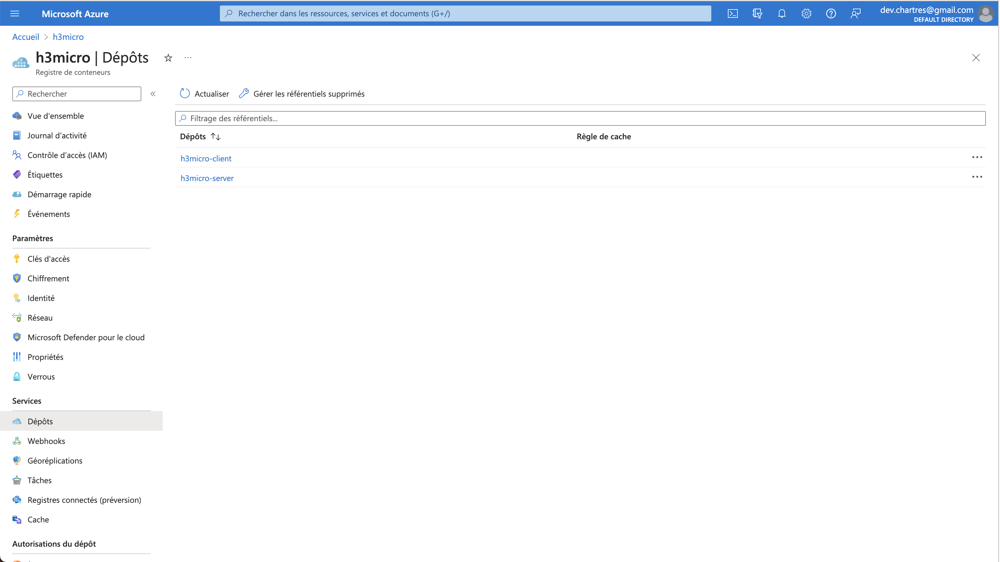
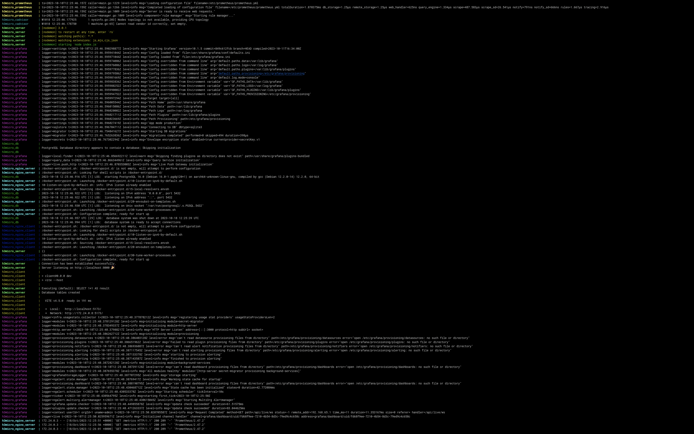
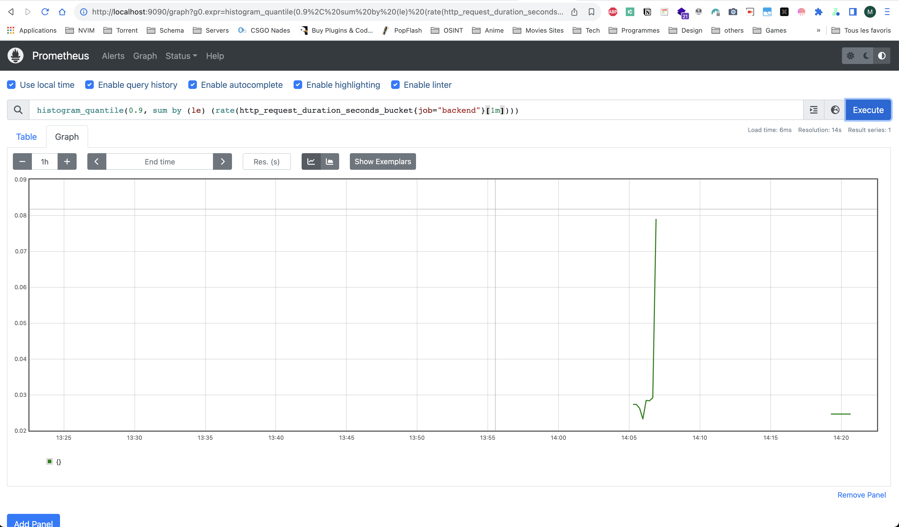

# README du Projet H3Micro

## IMPORTANT

Veuillez vous référer à [requirements.md](./requirements.md) pour une liste complète des tâches terminées et leur statut.

---

## Projet : H3Micro - Adopter les Microservices

### Introduction

Bienvenue dans le projet H3Micro ! Cette initiative sert de démonstration en direct de l'architecture des microservices, mettant en vedette un écosystème bien coordonné de composants clés :

- **Frontend** : Conçu avec React.
- **Backend** : Conçu avec Express.js.
- **Réseau de conteneurs** : Permettant une communication transparente entre tous les conteneurs.
- **Volumes** : Garantissant la persistance des données résilientes à travers les conteneurs.
- **Proxy Inverse** : Propulsé par Nginx pour sécuriser vos connexions, avec des certificats HTTPS pour le frontend et le backend.
- **Scripts** : Équipé d'une gamme de scripts utiles pour les vérifications de santé de Docker, les tests de base de données, et des tests complets de frontend et de backend.

### Prérequis

Avant de plonger dans ce projet, assurez-vous d'avoir installé les éléments suivants :

- [Docker](https://www.docker.com/get-started)
- [Docker Compose](https://docs.docker.com/compose/install)

### Liens d'Accès

Explorez les différents composants de ce projet via les liens suivants :

- **Frontend** :

    - HTTP : [http://localhost:5173](http://localhost:5173)
    - HTTPS : [https://localhost:444](https://localhost:444)

- **Backend** :

    - HTTP : [http://localhost:8000](http://localhost:8000)
    - HTTPS : [https://localhost](https://localhost)

- **Documentation Backend** :

    - HTTP : [http://localhost:8000/api-docs](http://localhost:8000/api-docs)
    - HTTPS : [https://localhost/api-docs](https://localhost/api-docs)

- **Production** :

    - Si le backend prend du retard au démarrage, c'est dû au démarrage à froid.
    - Frontend : pas encore fait
    - Backend : pas encore fait
    - Documentation Backend : pas encore fait

### Captures d'écran

### Schéma de l'Architecture de l'Environnement de Développement

Voici un aperçu architectural de l'environnement de développement :

### Schéma Généré avec `docker-compose-viz`

Le schéma généré à l'aide de la bibliothèque `docker-compose-viz` représente visuellement les relations complexes entre tous les services.

#### Hub Azure

#### Docker Compose en Action

## Surveillance

### Prométhée

### Grafana

